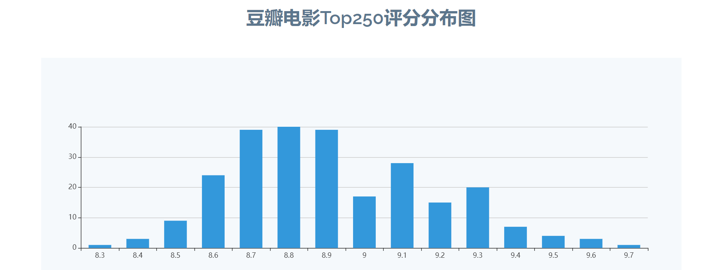

# douban_flask
#### 所需要的库

```
flask
sqlite3
bs4
re  
xlwt 
jieba
matplotlib
wordcloud
numpy
PIL
```


####  一个爬取豆瓣电影并可视化的项目

项目学习自B站https://www.bilibili.com/video/BV12E411A7ZQ

#### 项目截图





### 项目运行

spider为进行爬虫的主程序，to_spider为其的调用

运行to_spider可生成top250的excel与db文件（原始项目已经配备的有）

再运行app.py打开本地的1234端口即可打开本项目


### 注意

有时爬虫程序会被拒绝访问

解决方法：设置cookies

先在电脑端访问网址https://movie.douban.com/top250 再右键点击检查，找到network或网络选项卡再选择all标签，然后再次刷新页面

找到对应页面


将cookies复制下来，更换constant下对应的cookies值即可（注意cookies本身不是一个字符串，别忘最后开始和末尾加上单引号）


testCloud文件是生成词云的文件